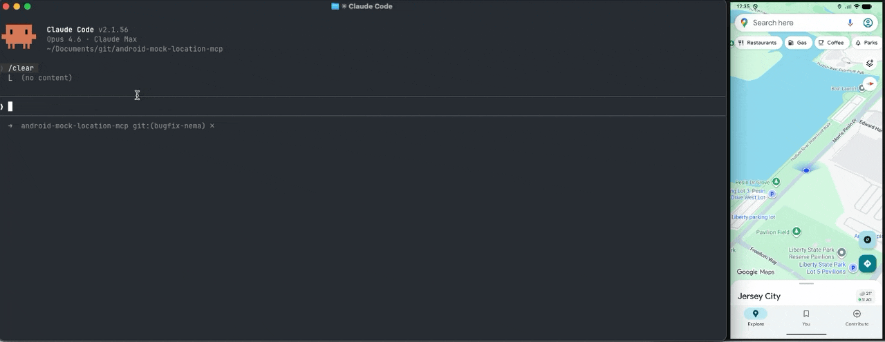

# android-mock-location-mcp

[](https://github.com/Manabu-GT/android-mock-location-mcp/actions/workflows/server-ci.yml)
[](https://github.com/Manabu-GT/android-mock-location-mcp/actions/workflows/android-ci.yml)
[](https://www.npmjs.com/package/android-mock-location-mcp)

[](https://opensource.org/licenses/Apache-2.0)

**Mock Android device GPS from any MCP client.** Control your test device's location for QA testing with built-in geocoding and street-level routing.



```
"Drive from downtown Denver to the airport with rush hour traffic"
"Simulate bad GPS signal for 30 seconds"
"Test the geofence at the nearest Whole Foods - bounce in and out 3 times"
```

## Why?

Testing location-aware apps is painful. You either:
- Physically walk around with a device
- Write complex ADB scripts with hardcoded coordinates
- Use clunky GUI mock location apps

This MCP server lets you control device location from Android Studio/Cursor/Claude Code/Codex..etc. Say "drive to the airport" instead of copy-pasting coordinates.

This server **controls your Android device's GPS** with built-in geocoding and street-level routing. No extra tools needed.

## Architecture

```
┌─────────────────────────────────────────────────────────┐
│  Developer Machine                                      │
│  ┌───────────────┐      ┌─────────────────────────────┐ │
│  │ Claude/Cursor │ ←──→ │ MCP Server                  │ │
│  │ or any MCP    │      │ • Geocoding + routing       │ │
│  │ client        │      │ • Route interpolation       │ │
│  └───────────────┘      └──────────┬──────────────────┘ │
└────────────────────────────────────┼────────────────────┘
                                     │ adb forward tcp:5005
                                     ▼
┌─────────────────────────────────────────────────────────┐
│  Android Device / Emulator                              │
│  ┌─────────────────────────────────────────────────┐    │
│  │ Mock Location Agent                             │    │
│  │ • Mock location provider                        │    │
│  │ • Socket listener (port 5005)                   │    │
│  └─────────────────────────────────────────────────┘    │
└─────────────────────────────────────────────────────────┘
```

## Quick Start

### 1. Install the MCP Server

```bash
npx android-mock-location-mcp
```

### 2. Configure Your MCP Client

<details>
<summary><b>Claude Desktop</b></summary>

Edit `~/Library/Application Support/Claude/claude_desktop_config.json` (macOS) or `%APPDATA%\Claude\claude_desktop_config.json` (Windows):

```json
{
  "mcpServers": {
    "android-mock-location-mcp": {
      "command": "npx",
      "args": ["-y", "android-mock-location-mcp"]
    }
  }
}
```

</details>

<details>
<summary><b>Cursor</b></summary>

Go to Settings → MCP → Add Server:

```json
{
  "command": "npx",
  "args": ["-y", "android-mock-location-mcp"]
}
```
</details>

<details>
<summary><b>Claude Code</b></summary>

```bash
claude mcp add android-mock-location-mcp -- npx -y android-mock-location-mcp
```
</details>

For provider options (Google, Mapbox), see [Server Configuration](server/README.md#configuration).

### 3. Install the Android Agent

Download the latest APK from [Releases](https://github.com/Manabu-GT/android-mock-location-mcp/releases) and install:
```bash
adb install -r android-mock-location-mcp-agent.apk
```

To build from source, see [android/README.md](android/README.md#build-and-install).

### 4. Enable Developer Options

Enable **Developer Options** on your device (Settings → About Phone → tap Build Number 7 times) and turn on **USB Debugging**.

That's it — the server automatically configures mock location permissions, starts the agent service, and sets up port forwarding when you first use a location tool.

See [android/README.md](android/README.md) for manual setup and troubleshooting.

### 5. Use It

In your MCP client:

```
> Set location to Times Square New York
> Drive from here to SFO airport at 60 km/h
```

## Available Tools

| Tool | Description |
|------|-------------|
| `geo_set_location` | Set to coordinates or place name |
| `geo_simulate_route` | Move along a route at specified speed (supports car/foot/bike profiles) |
| `geo_simulate_jitter` | Simulate GPS noise (urban canyon, drift) |
| `geo_test_geofence` | Test geofence entry/exit/bounce |
| `geo_stop` | Stop any active simulation |
| `geo_get_status` | Current mock location status |
| `geo_get_location` | Get device's real GPS position (for use as route starting point) |
| `geo_list_devices` | List connected Android devices |
| `geo_connect_device` | Connect to specific device |

For full parameter reference, see [server/README.md](server/README.md#tool-reference).

## Provider Configuration

Works out of the box with **OpenStreetMap** (free, no API key). For better results, consider using **Google** or **Mapbox** providers — they offer more accurate geocoding, full routing profile support (car/foot/bike), and higher rate limits.

| Provider | Pros | Limitations | Get an API Key |
|----------|------|-------------|----------------|
| `osm` (default) | Free, no API key needed | Car routing only, 1 req/sec geocoding limit | — |
| `google` | Accurate geocoding, full car/foot/bike routing | Requires API key (has free tier) | [Google Maps Platform](https://developers.google.com/maps/get-started) |
| `mapbox` | Accurate geocoding, full car/foot/bike routing | Requires access token (has free tier) | [Mapbox Access Tokens](https://account.mapbox.com/access-tokens/) |

For env vars, MCP client config examples, and provider details, see [server/README.md](server/README.md#configuration).

## Examples

```
# Basic location
"Set location to 37.7749, -122.4194"
"Move to Times Square"

# Route simulation
"Drive from SFO to downtown SF, simulate a commute with heavy traffic"
"Walk to the nearest Whole Foods"

# GPS testing
"Simulate bad GPS for 30 seconds, add urban canyon jitter with 50m radius"

# Geofence testing
"Test entering the nearest Starbucks geofence, bounce in and out of a 100m radius 5 times"
```

## Documentation

| Document | Description |
|----------|-------------|
| [Server README](./server/README.md) | Tool reference, provider configuration, development |
| [Android README](./android/README.md) | Build instructions, device setup, troubleshooting |
| [Protocol Spec](./protocol/PROTOCOL.md) | JSON command format |
| [Publishing](./PUBLISHING.md) | npm publish and release workflow |
| [Contributing](./CONTRIBUTING.md) | Development setup |

## Complementary Tools

This server focuses on device location control. For other needs:
- [mobile-mcp](https://github.com/mobile-next/mobile-mcp) — Cross-platform (iOS + Android) mobile UI automation
- [Android-MCP](https://github.com/CursorTouch/Android-MCP) — Lightweight Android device control via ADB + Accessibility API

## License

Apache 2.0 — see [LICENSE](./LICENSE)
